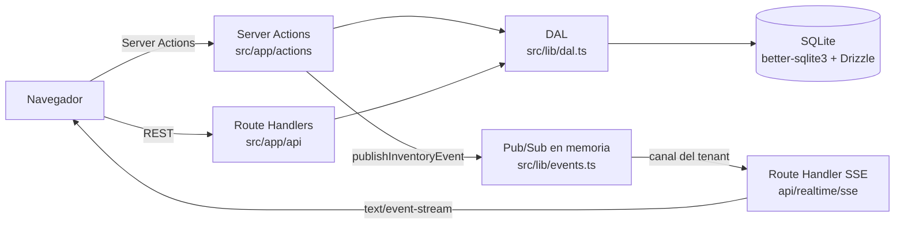

# Multi-Tenant Engine — 100% Local Enterprise Stack

> **Next.js 16 · TypeScript · SQLite + Drizzle · JWT (`jose`) · SSE** — a local-first multi-tenant SaaS engine with **zero cloud dependencies**.
> [Sección en español](#español)

## What is this? (EN)

A Next.js application that implements, from scratch and fully locally, the core pillars of an enterprise SaaS:

1. **Multi-tenancy with unbreakable isolation** — every row carries `tenant_id`, and every query goes through a Data Access Layer (DAL) that injects the tenant from the verified server-side JWT session. The client can never supply a `tenantId`.
2. **Local JWT authentication** — HS256 sessions signed with `jose`, `httpOnly` cookie, bcrypt password hashing (cost 12). No external identity providers.
3. **Realtime without third-party WebSockets** — Server-Sent Events (SSE) over an in-memory Pub/Sub (Node.js EventEmitter): stock changes reach other tabs/users of the *same tenant* in real time.
4. **Concurrency & traceability** — optimistic stock control (compare-and-swap), negative-stock prevention, and a full audit trail (`audit_logs`) of every operation.

Portfolio-oriented: one lean repository demonstrating security design, concurrency, streaming, and data discipline.

## Tech Stack

| Layer | Technology |
|---|---|
| Framework | Next.js 16 (App Router) |
| Language | TypeScript (strict) |
| Styling | Tailwind CSS |
| ORM / Migrations | Drizzle ORM + drizzle-kit |
| Database | SQLite (`better-sqlite3`, WAL) |
| Auth | `jose` (JWT HS256) + `bcryptjs` |
| Realtime | Server-Sent Events (SSE) + EventEmitter |
| Validation | Zod |

## Architecture



- **Isolation by `tenant_id`**: the `tenantId` **always** comes from the verified server-side JWT session (`getSession()`), **never** from client input (query, body or headers). Any client-supplied `tenantId` is forgeable.
- **Stock races**: updates use optimistic compare-and-swap — the `UPDATE` is conditioned on the read value (`WHERE stock = <read value>`). If another transaction won first, the operation returns a conflict instead of silently overwriting. Stock never goes negative.
- **Local SSE**: the client opens a `text/event-stream` authenticated with the same session cookie. Events published to a tenant's channel reach only that tenant's connections.
- **Secrets**: `JWT_SECRET` is mandatory in production (the app refuses to start without it outside development). Cookie: `httpOnly`, `sameSite=lax`, `secure` in production.

Full documentation: [`docs/ARCHITECTURE.md`](docs/ARCHITECTURE.md) and [`docs/SECURITY.md`](docs/SECURITY.md).

## Quick Start (EN)

```bash
npm install
npm run seed   # creates 2 tenants + test users (idempotent)
npm run dev    # http://localhost:3000
```

The seed prints test credentials to the console. Test credentials:

| Tenant | Role | Email | Password |
|---|---|---|---|
| Alfa | Owner | `owner@alfa.test` | `Alfa123!` |
| Alfa | Member | `member@alfa.test` | `Alfa123!` |
| Beta | Owner | `owner@beta.test` | `Beta123!` |
| Beta | Member | `member@beta.test` | `Beta123!` |

Validation:

```bash
npx tsc --noEmit
npm run lint
npm run test:isolation   # multi-tenant isolation proof (real DDL, in-memory SQLite)
npm run build
```

## Sprint Status

| Sprint | Focus | Status | Result |
|---|---|---|---|
| 01 | Auth + multi-tenant DAL | ✅ Completado | JWT HS256 (`jose`) in `httpOnly` cookie, bcrypt cost 12, DAL with session-derived `tenant_id` filter, idempotent seed. |
| 02 | Inventory CRUD + concurrency | ✅ Completado | CRUD with Zod validation, optimistic CAS on stock, prices in cents, per-tenant unique constraints. |
| 03 | Realtime SSE | ✅ Completado | In-memory per-tenant Pub/Sub (`events.ts`), authenticated `/api/realtime/sse` stream, EventSource hook with `router.refresh()`. |
| 04 | Audit logs + analytics | ✅ Completado | `audit_logs` with `ON DELETE SET NULL`, CSV export hardened against Formula Injection. |
| 05 | Portfolio polish + CI | ✅ Completado | GitHub Actions CI, tenant isolation test against the real DDL, Mermaid architecture docs. |

Executable specs for each sprint live in [`sprints/`](sprints/README.md).

## Key Architecture Decisions

| Decision | Implementation |
|---|---|
| CAS concurrency control | `UPDATE ... WHERE stock = <read value>` — explicit `STOCK_CONFLICT` instead of silent overwrites. |
| Zero-PII JWT | Payload carries only `sub`, `tenantId` and `role`; no personal data in the token. |
| Synchronous transactions | `better-sqlite3` rejects async transaction callbacks — all mutations use synchronous callbacks (bug fixed in Sprint 04). |
| DAL over RLS | SQLite has no Row Level Security: the DAL is the single, testable data gate. |
| Local SSE | One-way server notifications over HTTP; no extra dependencies. |
| Prices in cents | Integer cents avoid floating-point money errors. |

## Production Notes (EN)

- Set `JWT_SECRET` (≥ 256 bits). Without it, the app **will not start** in production.
- `DATABASE_URL` is optional (default: `./sqlite.db`).
- Scale note: the SSE Pub/Sub is in-memory (single process), coherent with the *local enterprise* principle. Multi-instance deployments would require an external broker — a conscious limitation, documented in `docs/ARCHITECTURE.md`.

## Documentation & References

- [`docs/ARCHITECTURE.md`](docs/ARCHITECTURE.md) — Mermaid diagrams, ADRs, security model, limitations.
- [`docs/SECURITY.md`](docs/SECURITY.md) — trust model, tenant isolation, credentials, session.
- [`docs/testing/`](docs/testing/) — manual test instructions per sprint.
- [`sprints/`](sprints/README.md) — frozen execution roadmap (01–05).
- [`CONTRIBUTING.md`](CONTRIBUTING.md) — branch rules, PR policy, CI gate.

---

## Español

### Qué es

Aplicación Next.js que implementa desde cero, y en local, los pilares de un SaaS empresarial:

1. **Multi-tenancy con aislamiento inquebrantable** — toda fila lleva `tenant_id` y toda consulta pasa por la Data Access Layer (DAL), que inyecta el tenant desde la sesión JWT verificada en el servidor. El cliente nunca puede aportar un `tenantId`.
2. **Autenticación local con JWT** — sesiones HS256 firmadas con `jose`, cookie `httpOnly`, contraseñas con hash bcrypt (cost 12). Sin proveedores externos de identidad.
3. **Tiempo real sin WebSockets de terceros** — Server-Sent Events (SSE) sobre un Pub/Sub en memoria (EventEmitter de Node.js): los cambios de stock llegan en tiempo real a otras pestañas/usuarios **del mismo tenant**.
4. **Concurrencia y trazabilidad** — control optimista de stock (compare-and-swap), prevención de stock negativo y auditoría (`audit_logs`) de toda operación.

### Inicio rápido (ES)

```bash
npm install
npm run seed   # crea 2 tenants y usuarios de prueba (idempotente)
npm run dev    # http://localhost:3000
```

El seed imprime las credenciales de prueba en consola. Credenciales de prueba:

| Empresa | Rol | Email | Contraseña |
|---|---|---|---|
| Alfa | Owner | `owner@alfa.test` | `Alfa123!` |
| Alfa | Member | `member@alfa.test` | `Alfa123!` |
| Beta | Owner | `owner@beta.test` | `Beta123!` |
| Beta | Member | `member@beta.test` | `Beta123!` |

Validación:

```bash
npx tsc --noEmit
npm run lint
npm run test:isolation   # prueba de aislamiento entre tenants (DDL real en SQLite en memoria)
npm run build
```

### Decisiones de arquitectura clave (ES)

- **Concurrencia CAS**: el `UPDATE` de stock exige que el valor leído siga vigente; si otra transacción ganó primero, se devuelve `STOCK_CONFLICT` en lugar de sobrescribir en silencio.
- **JWT zero-PII**: el token solo transporta `sub`, `tenantId` y `role`; ningún dato personal.
- **Transacciones síncronas**: `better-sqlite3` rechaza callbacks async en `db.transaction()`; toda mutación usa callbacks síncronos (bug corregido en Sprint 04).
- **DAL en lugar de RLS**: SQLite no tiene Row Level Security; la DAL es la única puerta de datos y es testeable con SQL crudo.
- **Precios en centavos**: enteros, sin errores de coma flotante en dinero.

### Estado de los sprints (ES)

Los 5 sprints están **completados** (tabla *Sprint Status*): 01 auth/DAL, 02 inventario CAS + zod, 03 SSE en tiempo real, 04 `audit_logs` + export CSV, 05 CI + test de aislamiento + documentación.

### Producción (ES)

- Define `JWT_SECRET` (≥ 256 bits). Sin él, la aplicación **no inicia** en producción.
- `DATABASE_URL` es opcional (por defecto `./sqlite.db`).
- Nota de escala: el Pub/Sub SSE vive en memoria (proceso único). Para multi-instancia haría falta un broker externo — limitación consciente documentada en `docs/ARCHITECTURE.md`.

### Documentación (ES)

- [`docs/ARCHITECTURE.md`](docs/ARCHITECTURE.md) — diagramas Mermaid, ADRs, modelo de seguridad, limitaciones.
- [`docs/SECURITY.md`](docs/SECURITY.md) — modelo de confianza, aislamiento, credenciales, sesión.
- [`docs/testing/`](docs/testing/) — instrucciones de prueba manual por sprint.
- [`sprints/`](sprints/README.md) — hoja de ruta congelada (01–05).
- [`CONTRIBUTING.md`](CONTRIBUTING.md) — ramas, revisión cruzada y gate de CI.
