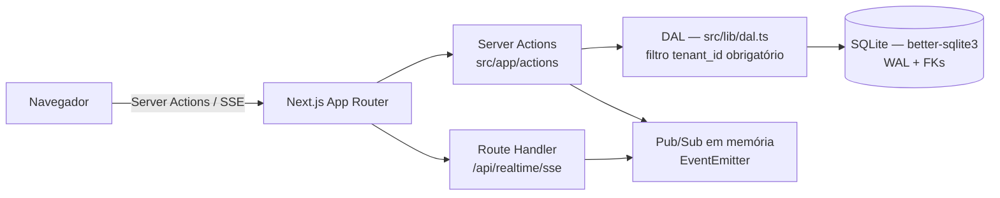

# Multi-Tenant Inventory & Realtime Sync Engine (Local Enterprise Architecture)

> Motor SaaS multi-inquilino de sincronização de inventário em tempo real, com isolamento de dados a nível de aplicação (DAL), autenticação JWT local e Server-Sent Events (SSE) — **sem nenhuma dependência de serviços em nuvem**.

## Descrição

O **Multi-Tenant Engine** é uma aplicação Next.js que implementa, do zero e localmente, os quatro pilares de um SaaS corporativo:

1. **Multi-tenancy com isolamento inquebrável** — todo registro carrega `tenant_id` e toda consulta passa por uma Data Access Layer (DAL) que injeta o tenant da sessão JWT verificada no servidor.
2. **Autenticação local com JWT** — sessões assinadas com HS256 (`jose`), cookie `httpOnly`, senhas com hash `bcrypt` (cost 12). Sem serviços externos de identidade.
3. **Tempo real sem WebSockets de terceiros** — Server-Sent Events (SSE) sobre um Pub/Sub em memória (EventEmitter do Node.js): mudanças de estoque aparecem em outras abas/usuários do mesmo tenant em tempo real.
4. **Concorrência e rastreabilidade** — controle otimista de estoque (compare-and-swap), prevenção de estoque negativo e trilha de auditoria (`audit_logs`) de toda operação.

Arquitetura orientada a portfólio: o mesmo repositório demonstra design de segurança, concorrência, streaming e disciplina de dados em um stack enxuto.

## Tech Stack

| Camada | Tecnologia |
|---|---|
| Framework | Next.js 16 (App Router) |
| Linguagem | TypeScript |
| Estilos | Tailwind CSS |
| ORM / Migrações | Drizzle ORM + drizzle-kit |
| Banco de dados | SQLite (`better-sqlite3`, WAL) |
| Autenticação | `jose` (JWT HS256) + `bcryptjs` |
| Tempo real | Server-Sent Events (SSE) + EventEmitter |
| Validação | Zod |

## Arquitetura & Segurança



- **Isolamento por `tenant_id`**: toda linha de `users`, `products` e `audit_logs` pertence a um tenant. A regra central: o `tenantId` **sempre** vem da sessão JWT verificada no servidor (`getSession()`), **nunca** de parâmetros do cliente (query, body ou headers). Qualquer `tenantId` de origem cliente é falsificável e violaria o isolamento.
- **Corrida de estoque**: atualizações usam controle otimista — o `UPDATE` é condicionado ao valor lido (`WHERE stock = <valor lido>`). Se outra transação venceu primeiro, a operação é recusada com mensagem de conflito (sem sobrescrita silenciosa). Estoque nunca fica negativo: a validação acontece no servidor antes do update.
- **SSE local**: o cliente abre um fluxo `text/event-stream` autenticado pela mesma cookie de sessão. Eventos publicados no canal de um tenant chegam apenas às conexões daquele tenant; conexões de outros tenants não recebem nada.
- **Segredos**: `JWT_SECRET` obrigatório em produção (a aplicação recusa iniciar sem ele fora de desenvolvimento). Cookie `httpOnly`, `sameSite=lax`, `secure` em produção.

Documentação completa em [`docs/ARCHITECTURE.md`](docs/ARCHITECTURE.md) e [`docs/SECURITY.md`](docs/SECURITY.md).

## Início Rápido

```bash
npm install
npm run seed   # cria 2 tenants e usuários de teste (idempotente)
npm run dev    # http://localhost:3000
```

As credenciais de teste são impressas em console ao executar o seed (2 tenants, 2 usuários por tenant).

Validação:

```bash
npx tsc --noEmit
npm run lint
npm run test:isolation   # prova de isolamento entre tenants
```

## Estado da Implementação

| Sprint | Foco | Status |
|---|---|---|
| 01 | Autenticação + DAL com isolamento por `tenant_id` | Núcleo pronto (`auth`, `password`, `schema`); pendentes DAL, `/login`, `/dashboard` e seed |
| 02 | CRUD de inventário + concorrência otimista | Planejado |
| 03 | Tempo real com SSE local | Planejado |
| 04 | Auditoria (`audit_logs`) + analítica | Planejado |
| 05 | Polimento de portfólio + CI | Planejado |

Especificações executáveis de cada sprint em [`sprints/`](sprints/README.md) — projetadas para execução autônoma por agentes de IA.

## Estrutura

```text
app/                  # App Router: páginas, Server Actions, Route Handlers
src/
  db/                 # schema Drizzle, cliente SQLite, seed
  lib/                # auth (JWT), password (bcrypt), DAL, pub/sub
  hooks/              # hooks de cliente (tempo real)
scripts/              # testes de isolamento entre tenants
drizzle/              # migrações SQL versionadas
docs/                 # arquitetura, segurança, UI/UX
sprints/              # roteiro congelado de execução
```

## Produção

- Defina `JWT_SECRET` (≥ 256 bits). Sem ele, a aplicação **não inicia** em produção.
- `DATABASE_URL` opcional (padrão: `./sqlite.db`).
- Nota de escala: o Pub/Sub SSE é em memória (processo único), coerente com o princípio *local enterprise* do projeto. Multi-instância exigiria um broker externo — limitação consciente, documentada em `docs/ARCHITECTURE.md`.

## Contribuição

Ver [`CONTRIBUTING.md`](CONTRIBUTING.md).
