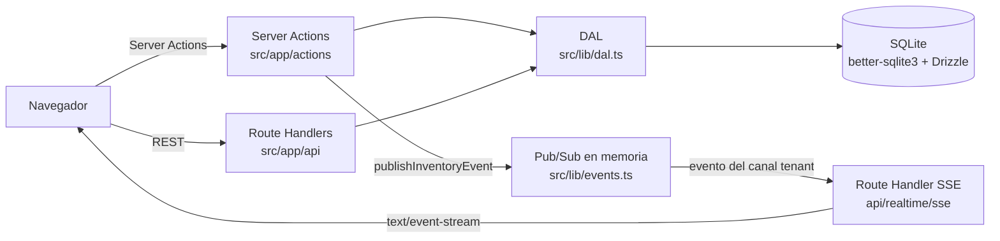
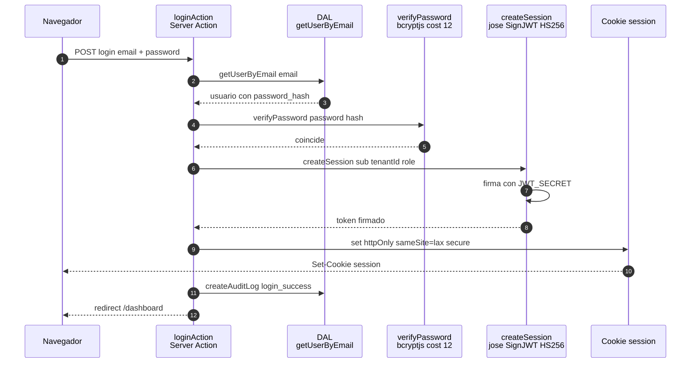
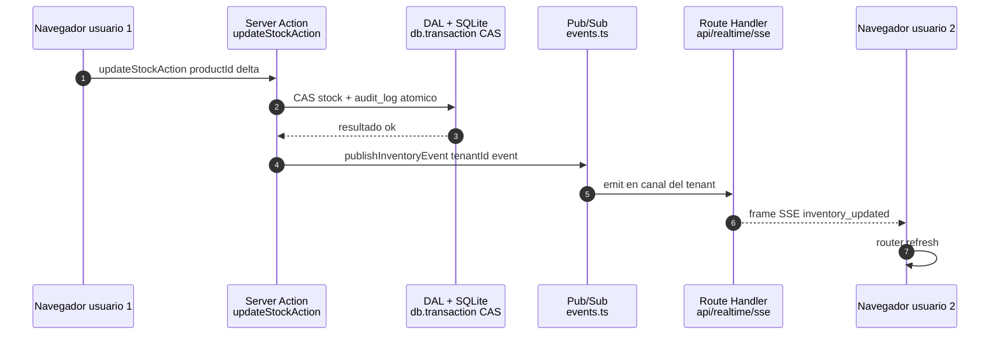
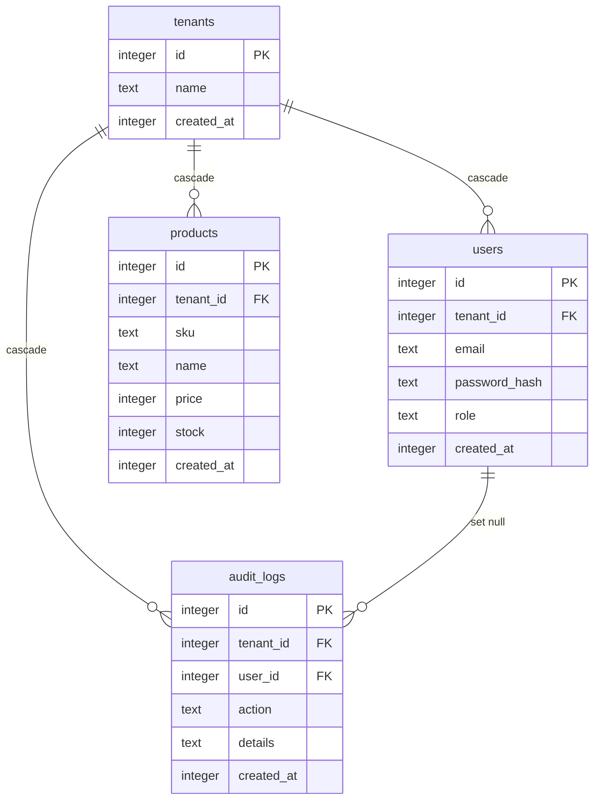

# Arquitectura — Multi-Tenant Engine

> Documento vivo de arquitectura del motor multi-tenant local (Next.js 16 + SQLite).
> Complementos: `docs/SECURITY.md` (modelo de seguridad), `docs/testing/` (instrucciones de prueba) y `sprints/` (hoja de ruta ejecutable por sprints).

## 1. Visión general

Aplicación SaaS multi-tenant **100 % local** (cero dependencias de servicios cloud) que demuestra los pilares de un sistema empresarial: aislamiento de datos por tenant, autenticación local, tiempo real y auditoría, sobre un stack mínimo.

| Capa | Tecnología | Responsabilidad |
|---|---|---|
| Aplicación | Next.js 16 (App Router) | Server Components, Server Actions, Route Handlers |
| Lenguaje | TypeScript (estricto) | Tipado completo, contratos de datos |
| Datos | SQLite + `better-sqlite3` + Drizzle ORM | Persistencia local, migraciones SQL versionadas |
| Autenticación | `jose` (JWT HS256) + `bcryptjs` (cost 12) | Sesiones firmadas en cookie httpOnly |
| Tiempo real | Server-Sent Events (SSE) + `EventEmitter` | Sincronización de inventario entre usuarios del tenant |
| Validación | Zod | Validación de entrada en Server Actions |

### Principios rectores

1. **El `tenantId` nace de la sesión verificada**, nunca de un input del cliente.
2. **Una sola puerta a los datos**: toda consulta pasa por la DAL (`src/lib/dal.ts`).
3. **Cero secretos en el cliente**: el JWT no transporta datos personales.
4. **Concurrencia sin sobrescritura silenciosa**: compare-and-swap sobre stock.
5. **Dependencias mínimas**: sin broker, sin DB cloud, sin servicios externos.

## 2. Diagrama de sistema



**Lectura del diagrama:** el navegador nunca habla con la base de datos. Las mutaciones entran por Server Actions; las lecturas y exportaciones por Route Handlers. Ambos caminos atraviesan la DAL, que inyecta el `tenant_id` de la sesión JWT verificada. Las mutaciones de inventario, además, publican un evento en el Pub/Sub en memoria; el Route Handler SSE lo reenvía como frame `text/event-stream` a los navegadores suscritos **del mismo tenant**.

## 3. Secuencia de autenticación



Puntos clave: la contraseña se compara contra el hash bcrypt (nunca en texto plano); el JWT solo transporta `sub`, `tenantId` y `role` (zero-PII); la cookie es `httpOnly` (inaccesible desde JavaScript), `sameSite=lax` y `secure` en producción; el login exitoso y el fallido se auditan.

## 4. Secuencia de tiempo real (SSE)



Puntos clave: la mutación y su `audit_log` se ejecutan en la misma transacción; solo si la transacción confirma se publica el evento; el evento viaja por el canal `tenant:{id}` del EventEmitter, por lo que un tenant nunca recibe eventos de otro; el cliente (EventSource) re-sirve los Server Components con `router.refresh()`.

## 5. Modelo de datos



Reglas del modelo:

- **Índice único compuesto** `(tenant_id, sku)` en `products` y `(tenant_id, email)` en `users`: un SKU o email puede repetirse **entre** tenants, nunca **dentro** del mismo tenant.
- **Cascade de tenant**: borrar un tenant elimina sus `users`, `products` y `audit_logs` (nunca quedan huérfanos).
- **`set null` de usuario**: borrar un usuario **conserva** sus `audit_logs` con `user_id = NULL` — la auditoría sobrevive al borrado.
- Fechas en epoch milisegundos (default dinámico `unixepoch() * 1000`); precios en **centavos** (`integer`).

## 6. Regla de oro: aislamiento por `tenant_id` (DAL)

SQLite no tiene Row Level Security. El aislamiento entre tenants es responsabilidad exclusiva de la capa de acceso a datos (`src/lib/dal.ts`):

- Toda función de negocio recibe el `tenantId` **exclusivamente** de `getSession()` (`src/lib/auth.ts`), que verifica firma y expiración del JWT.
- Toda consulta o mutación sobre `users`, `products` y `audit_logs` filtra con `eq(tabla.tenantId, tenantId)`.
- Única excepción documentada: `getUserByEmail` (global) — es el único punto del sistema donde aún no existe sesión (flujo de login); el tenant se obtiene del usuario encontrado.
- Cualquier `tenantId` de origen cliente (query, body o headers) es falsificable y está **prohibido**.

Esta regla se demuestra de forma ejecutable con `npm run test:isolation`, que además documenta qué ocurre si se omite el filtro (consulta "maliciosa" que atraviesa tenants).

## 7. Concurrencia y transacciones

**Compare-and-swap (CAS) sobre stock** (`updateProductStock`): se lee el stock, se valida que el resultado no sea negativo y el `UPDATE` exige que `stock` siga valiendo lo leído (`WHERE stock = <valor leído>`). Si otra transacción movió el stock entre lectura y escritura (`changes === 0`), la operación devuelve `STOCK_CONFLICT` — nunca sobrescribe en silencio.

**Transacciones síncronas obligatorias**: `better-sqlite3` es un driver síncrono. Pasar un callback `async` a `db.transaction()` lanza `TypeError: Transaction function cannot return a promise` y la transacción nunca se ejecuta (bug detectado y corregido en Sprint 04). Las Server Actions y la DAL de mutación usan callbacks síncronos y retorno directo.

**Atomicidad negocio + auditoría**: cada mutación de inventario y su `audit_log` se ejecutan dentro de la misma transacción: o se confirman ambos, o ninguno.

## 8. Registro de decisiones (ADRs)

| Decisión | Alternativas consideradas | Decisión y motivo |
|---|---|---|
| SQLite local vs base de datos cloud | Postgres/Supabase, MySQL remoto | SQLite (`better-sqlite3`, WAL): cero dependencias cloud, cero latencia de red, despliegue de un solo artefacto. Coherente con el principio *local enterprise* del portafolio. |
| JWT en cookie vs sesión en BD | Tabla `sessions` en SQLite | JWT HS256 (`jose`) en cookie httpOnly: sin estado en BD, verificación barata en cada request y payload mínimo (zero-PII). |
| SSE vs WebSockets | `ws`, Socket.IO, polling | SSE unidireccional sobre HTTP: el servidor solo notifica; las mutaciones van por Server Actions. Sin dependencias extra, reconexión automática nativa del navegador. |
| DAL vs RLS | Row Level Security en la BD | SQLite no tiene RLS nativa. La DAL centraliza el filtro `tenant_id` desde la sesión verificada y es testeable con SQL crudo. |
| Precios en centavos | REAL/float, DECIMAL | `integer` en centavos: sin imprecisiones de coma flotante en dinero; el formato se aplica solo en presentación. |
| CAS para stock | Lock pesimista, transacciones largas | UPDATE condicionado al valor leído: sin bloqueos, sin sobrescritura silenciosa y conflicto explícito (`STOCK_CONFLICT`). |
| Transacciones síncronas | `db.transaction(async ...)` | better-sqlite3 no acepta callbacks async (lanza `TypeError`). Callbacks síncronos y retorno directo — bug real corregido en Sprint 04. |
| DDL real como fuente del test de aislamiento | Fixtures DDL duplicados en el test | El test ejecuta `drizzle/*.sql` en orden sobre una base en memoria: si el esquema cambia, el test se adapta solo. |

## 9. Modelo de seguridad

Resumen ejecutivo; detalle completo en [`docs/SECURITY.md`](SECURITY.md).

- **Regla del `tenantId`**: siempre desde `getSession()` (sesión JWT verificada en el servidor); jamás desde query, body o headers del cliente.
- **Cookie de sesión**: `httpOnly`, `sameSite=lax`, `secure` en producción, `maxAge` 7 días.
- **Contraseñas**: hash bcrypt cost 12 (`bcryptjs`); nunca en texto plano ni en logs.
- **JWT**: HS256 firmado con `JWT_SECRET`; en producción la aplicación **se niega a iniciar** sin él (fail fast); en desarrollo se genera una clave efímera por proceso con advertencia única.
- **Auditoría**: los `details` de `audit_logs` solo contienen datos no sensibles; nunca `passwordHash` ni tokens.
- **Export CSV**: mitigación de Formula Injection (celdas que empiezan por `=`, `+`, `-`, `@`, tab o CR reciben una comilla simple) además del escape RFC 4180.

## 10. Limitaciones conscientes y evolución

| Limitación | Impacto actual | Camino de evolución |
|---|---|---|
| Pub/Sub en memoria (EventEmitter) | Solo funciona en **un proceso** (deploy único); multi-instancia no comparte eventos | Sustituir `src/lib/events.ts` por un broker (Redis Streams, NATS, Postgres LISTEN/NOTIFY) manteniendo el contrato `publishInventoryEvent` / `subscribeToInventoryEvents` |
| SQLite: un solo escritor | Contención de escritura en cargas altas | Particionado por tenant, o migración a Postgres manteniendo la DAL como única puerta de datos |
| Retención de `audit_logs` sin purga | Crecimiento indefinido de la tabla | Política de retención (p. ej. partición por mes + export/archive), tarea pendiente |
| Clave JWT efímera en desarrollo | Las sesiones no sobreviven a reinicios en dev | Documentado; en producción `JWT_SECRET` es obligatorio |

## 11. Verificación

```bash
npx tsc --noEmit          # tipos estrictos
npm run lint              # ESLint (config Next.js)
npm run seed              # seed idempotente (2 tenants, credenciales en consola)
npm run test:isolation    # aislamiento multi-tenant contra el DDL real
npm run build             # build de producción
```

El workflow de CI (`.github/workflows/ci.yml`) ejecuta estos pasos en cada push a `main`/`beta` y en cada Pull Request.
